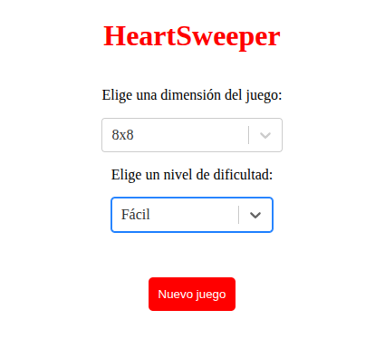
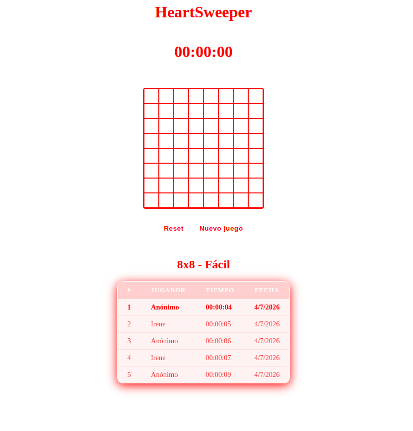

# HeartSweeper ❤️

Versión en React de un buscaminas con temática de corazones. Las minas se sustituyen por corazones: el objetivo es descubrir todas las celdas sin revelar ningún corazón.

Proyecto de aprendizaje de React desarrollado desde cero.

## Captura de pantalla

<div align="center">
  
  <p>Pantalla de inicio</p>
  
  <p>Pantalla de juego</p>
</div>

## Características

- Tablero configurable: dimensión 8×8 o 16×16
- Tres niveles de dificultad: Fácil (10%), Intermedio (14%), Difícil (18%) de corazones
- Revelado en cascada de celdas vacías (flood fill recursivo)
- Cronómetro que arranca con el primer click y se detiene al finalizar la partida
- Modal de resultado con corazones rotos 💔 al perder o corazones enteros ❤️ al ganar
- Animación de corazones cayendo al ganar
- Ranking de mejores tiempos por combinación de dimensión y dificultad, con una API propia en Cloudflare Workers para conservar las puntuaciones al jugar desde diferentes dispositivos
- Botones Reiniciar (nuevo tablero, mismas opciones) y Nuevo juego (vuelve a la selección)

## Tecnologías

- React 19
- Vite
- Sass (SCSS)
- react-select
- Cloudflare Workers (API del ranking)

## Estructura del proyecto

```
src/
├── components/
│   ├── Board.jsx       # Lógica del tablero: generación, flood fill, detección de victoria/derrota
│   ├── Cell.jsx        # Celda individual del tablero
│   ├── Game.jsx        # Estado global: dimensión, dificultad, timer, ranking, modal
│   ├── Hearts.jsx      # Utilidades: colocación y conteo de corazones
│   ├── Timer.jsx       # Cronómetro controlado desde Game
│   ├── Modal.jsx       # Popup de resultado con guardado de puntuación
│   ├── Ranking.jsx     # Tabla de mejores tiempos
│   └── Button.jsx      # Botón reutilizable
├── api/
│   └── scoresApi.js    # Llamadas a la API de ranking (Cloudflare Workers)
├── utils.js            # formatearTiempo (compartido entre Timer, Modal y Ranking)
└── App.jsx
```

## Ranking online

El ranking de mejores tiempos no se guarda en localStorage, sino en una API propia desplegada en **Cloudflare Workers**. La app hace peticiones HTTP (`fetch`) a esta API para guardar (`POST /api/scores`) y consultar (`GET /api/scores`) las puntuaciones, filtradas por dimensión y dificultad. De esta forma el ranking es compartido y persiste independientemente del dispositivo o navegador desde el que se juegue.

## Instalación y uso

```bash
npm install
npm run dev
```

## Conceptos de React aplicados

- `useState` y `useEffect` en múltiples componentes
- `useRef` para el contenedor de la animación de corazones
- Lifting state: `abiertas`, `segundos`, `juegoTerminado` y `rankingActual` elevados a `Game`
- Renderizado de listas con `key`
- Formularios controlados (input de nombre en el Modal)
- Patrón `key` para forzar remontaje de componentes (`boardKey`)
- Inicializador lazy de `useState` para la generación del tablero
- Separación de lógica pura (`expandirCelda`) y actualizaciones de estado (`revealCell`)
- CSS custom properties desde JSX (`--dimension`) para el grid dinámico
